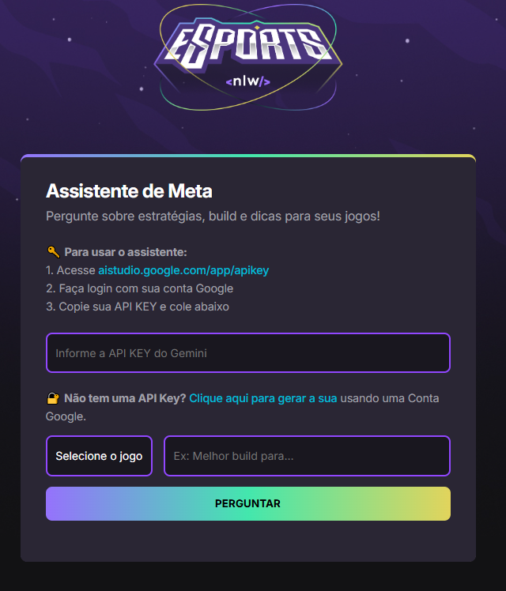
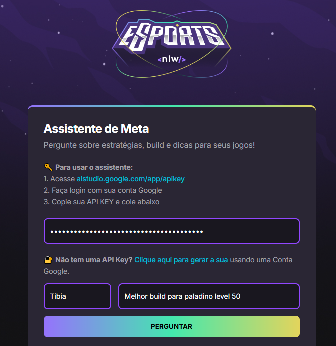
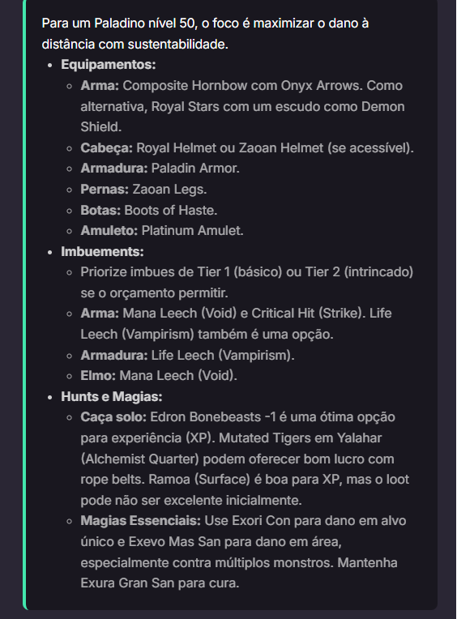

<h1 align="center"> Assistente de Meta </h1>

Aplicação web desenvolvida para auxiliar jogadores com estratégias, builds e dicas dos jogos Tibia, Pokémon PXG e Bloons TD 6, usando IA generativa Gemini da Google.

  <a href="#-tecnologias">Tecnologias</a>&nbsp;&nbsp;&nbsp;|&nbsp;&nbsp;&nbsp;
  <a href="#-projeto">Projeto</a>&nbsp;&nbsp;&nbsp;|&nbsp;&nbsp;&nbsp;
  <a href="#-layout">Layout</a>&nbsp;&nbsp;&nbsp;|&nbsp;&nbsp;&nbsp;
  <a href="#-funcionalidades">Funcionalidades</a>&nbsp;&nbsp;&nbsp;|&nbsp;&nbsp;&nbsp;
  <a href="#-como-usar">Como Usar</a>

  

 

  

## 🚀 Tecnologias

Esse projeto foi desenvolvido durante o #20 NLW Agents trilha iniciante da Rocketseat
com as seguintes tecnologias:

- HTML5
- CSS3
- JavaScript (ES6+)
- API Gemini (Google Generative Language)
- Git e GitHub

## 💻 Projeto

O **Assistente de Meta** é uma ferramenta que responde perguntas sobre estratégias e builds para jogos populares como Tibia, Pokémon PXG e Bloons TD 6 utilizando inteligência artificial da Google Gemini.  
O foco é entregar respostas rápidas, atualizadas e específicas para cada jogo, ajudando jogadores a aprimorar suas táticas.

## 🎨 Layout

O layout é simples e responsivo, com foco em usabilidade. Você pode personalizar estilos modificando o arquivo `style.css` e a pasta `assets` para imagens.

## ⚙️ Funcionalidades

- Seleção do jogo para perguntas específicas (Tibia, Pokémon PXG, Bloons TD 6)
- Input seguro para a API Key da Google Gemini
- Conversa em linguagem natural com IA generativa
- Respostas renderizadas com markdown para melhor visualização
- Feedback visual durante a consulta (loading no botão)
- Instruções simples para obtenção da API Key embutidas na interface

## 📱 Telas

  
  

## 📖 Como Usar

1. Gere sua API Key acessando:  
   [Google AI Studio - API Key](https://aistudio.google.com/app/apikey)  
2. Cole a chave no campo indicado no formulário.  
3. Selecione o jogo desejado.  
4. Digite sua pergunta sobre o jogo.  
5. Clique em "Perguntar" e aguarde a resposta gerada pela IA.  

---

## :memo: Licença

Esse projeto está sob a licença MIT.

---

Feito com 💖 por Kleber Rafael 🚀
